# System Architecture - Evergreen ERP

> เอกสารสถาปัตยกรรมระบบ Evergreen ERP สำหรับบริษัท C.H.H.
> ปรับปรุงล่าสุด: มีนาคม 2026

---

## 1. System Overview

Evergreen ERP คือระบบ Enterprise Resource Planning แบบ Full-Stack ที่พัฒนาบน Next.js App Router สำหรับบริษัท C.H.H. ระบบครอบคลุมการจัดการทรัพยากรองค์กรทั้งหมด ได้แก่:

- **HR** (ทรัพยากรบุคคล) -- จัดการพนักงาน แผนก ฝ่าย ตำแหน่ง
- **Sales/CRM** (การขาย) -- จัดการ Leads, Contacts, Accounts, Opportunities, Quotations, Orders
- **Finance** (การเงินและบัญชี) -- Trial Balance, AR/AP, ใบแจ้งหนี้, การเก็บเงิน
- **IT** (เทคโนโลยีสารสนเทศ) -- ทรัพย์สินไอที, Helpdesk, ซอฟต์แวร์, คำขอพัฒนา, System Access
- **Production** (การผลิต) -- ใบสั่งผลิต, BOM, Item Ledger Entries
- **Marketing/Omnichannel** (การตลาด) -- แชทผ่าน LINE/Facebook, AI Agent, ใบเสนอราคา
- **TMS** (ระบบขนส่ง) -- ยานพาหนะ, คนขับ, การจัดส่ง, เชื้อเพลิง, ซ่อมบำรุง, GPS Tracking
- **Warehouse/RFID** (คลังสินค้า) -- สินค้าคงคลัง, พิมพ์/สแกน RFID, โอนย้ายสินค้า
- **Performance** (ผลการปฏิบัติงาน) -- KPI, OKR, 360-Degree Evaluation, Value Evaluation
- **RBAC** (ควบคุมการเข้าถึง) -- Users, Roles, Permissions, Resources, Actions, Access Logs

ระบบเชื่อมต่อกับ Microsoft Dynamics 365 Business Central ผ่าน OData เพื่อ sync ข้อมูลลูกค้า สินค้า คำสั่งขาย และใบสั่งผลิต พร้อมทั้งรองรับ LINE Messaging API, Facebook Messenger API และ AI Agent ผ่าน OpenRouter

---

## 2. Tech Stack

| Layer | Technology | รายละเอียด |
|-------|-----------|------------|
| **Frontend** | Next.js 16 (App Router), React 19, TailwindCSS, HeroUI | UI framework พร้อม React Compiler (babel-plugin-react-compiler) |
| **Backend** | Next.js API Routes (Serverless) | API แบบ serverless ทำงานบน Vercel Functions |
| **Database** | Supabase (PostgreSQL) | พร้อม Realtime Subscriptions และ Storage สำหรับไฟล์/รูปภาพ |
| **Authentication** | Supabase Auth | Cookie-based SSR สำหรับ web, Bearer Token สำหรับ mobile app |
| **AI** | OpenRouter API (Google Gemini 2.5 Flash Lite) | ใช้สำหรับ Omnichannel Chat auto-reply, OCR สลิปการโอนเงิน, สรุปออเดอร์ |
| **ERP Integration** | Microsoft Dynamics 365 Business Central | OData V4 สำหรับ sync ลูกค้า, สินค้า, คำสั่งขาย, ใบสั่งผลิต |
| **Messaging** | LINE Messaging API, Facebook Graph API | Webhook รับข้อความ, Push API ส่งข้อความออก |
| **Hardware** | Chainway CP30 RFID Printer | ZPL over TCP/IP (port 9100), RFID EPC encoding 96-bit |
| **Hardware** | Chainway C72 RFID Handheld Scanner | สแกน RFID tags สำหรับงานคลังสินค้า |
| **Deployment** | Vercel | Serverless deployment พร้อม Edge Functions |
| **Maps** | Leaflet + React-Leaflet | แผนที่สำหรับ GPS Tracking ในระบบขนส่ง |
| **PDF/Barcode** | jsPDF, JsBarcode, html-to-image | สร้างเอกสาร PDF, Barcode, Shipping Labels |

---

## 3. Architecture Diagram

### 3.1 High-Level System Architecture

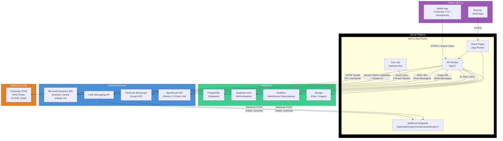

### 3.2 Request Flow -- Web (Cookie SSR)

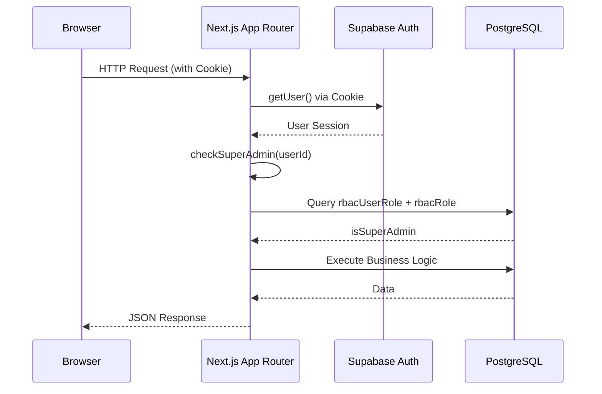

### 3.3 Request Flow -- Mobile (Bearer Token)

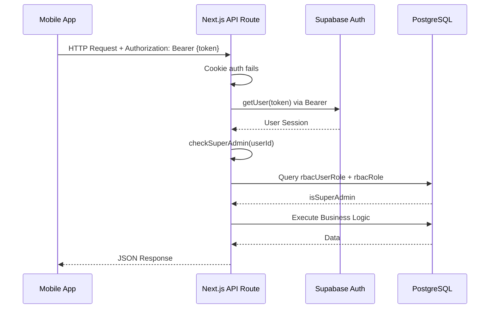

### 3.4 BC Sync Pipeline

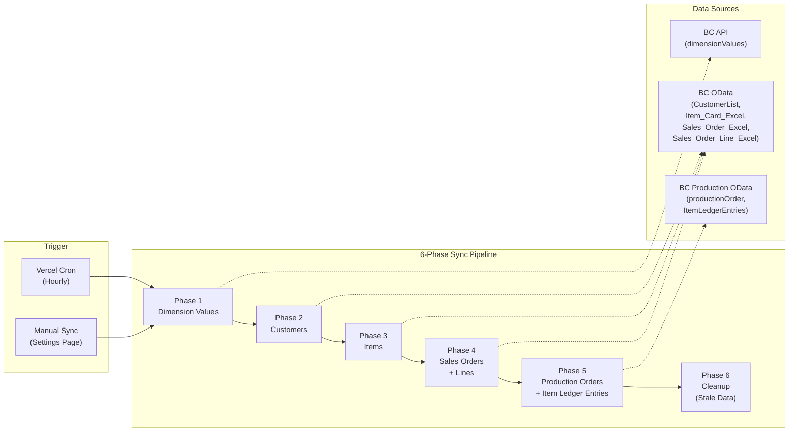

### 3.5 Omnichannel Chat Flow

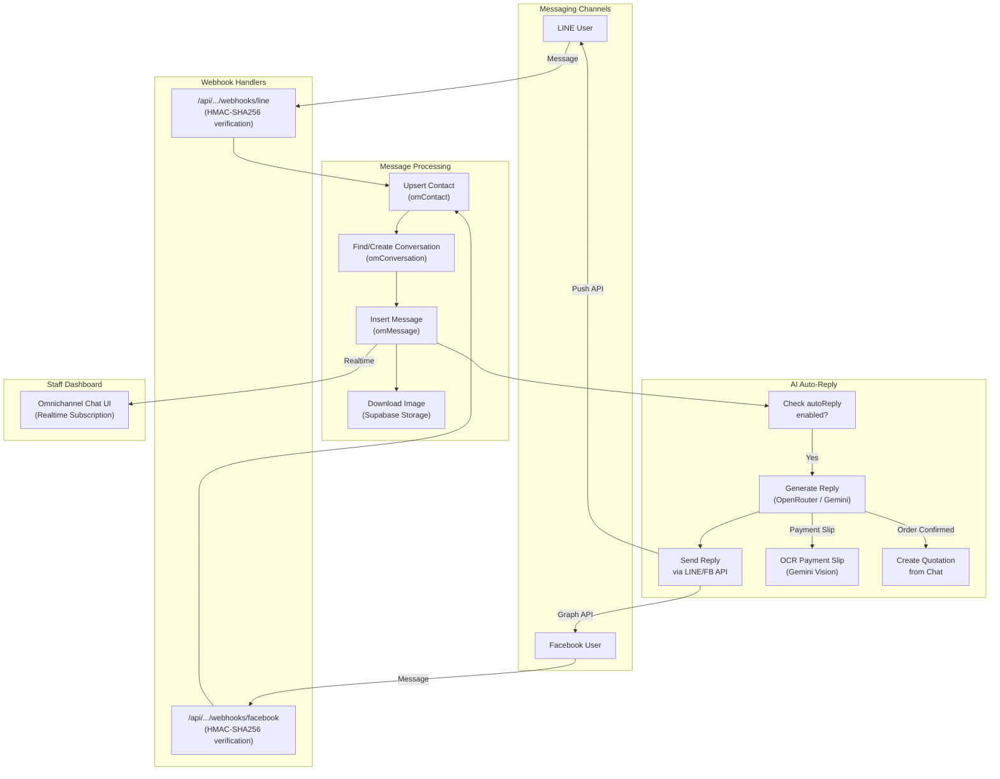

---

## 4. Module Map

ระบบ Evergreen ERP ประกอบด้วย 18 โมดูล โดยแต่ละโมดูลจัดอยู่ใน sidebar menu:

| # | Module ID | ชื่อภาษาไทย | รายละเอียด | สถานะ |
|---|-----------|-------------|-----------|-------|
| 1 | `overview` | ภาพรวม | Dashboard รวม, Analytics, สรุปข้อมูลทุกโมดูล | Active |
| 2 | `hr` | ทรัพยากรบุคคล | จัดการพนักงาน (Employees), แผนก (Departments), ฝ่าย (Divisions), ตำแหน่ง (Positions), Dashboard | Active |
| 3 | `performance` | ผลการปฏิบัติงาน | KPI (Definitions, Assignments, Records), OKR (Objectives, Key Results, Check-ins), 360-Degree Evaluation (Cycles, Nominations, Responses, Results, Competencies), Value Evaluation | Active |
| 4 | `it` | เทคโนโลยีสารสนเทศ | ทรัพย์สินไอที (Assets), Helpdesk Tickets, ซอฟต์แวร์ (Software), คำขอพัฒนา (Dev Requests), สิทธิ์เข้าระบบ (System Access), เครือข่าย (Network), ความปลอดภัย (Security), Dashboard | Active |
| 5 | `finance` | การเงินและบัญชี | งบทดลอง (Trial Balance), ลูกหนี้ค้างชำระ (Aged Receivables), เจ้าหนี้ค้างชำระ (Aged Payables), ใบแจ้งหนี้ขาย (Sales Invoices), ใบแจ้งหนี้ซื้อ (Purchase Invoices), การเก็บเงิน (Collections), Dashboard | Active |
| 6 | `sales` | การขาย | CRM: Leads, Contacts, Accounts, Opportunities; ใบเสนอราคา (Quotations), คำสั่งขาย (Orders), กิจกรรม (Activities), BCI Projects, รายงาน (Reports), Dashboard | Active |
| 7 | `marketing` | การตลาด | Omnichannel Chat (LINE/Facebook), ใบเสนอราคา (Quotations), สินค้าคงคลัง (Stock Items), คำสั่งขาย (Sales Orders), AI Agent (auto-reply, OCR, order extraction), Shipping Labels, Analytics | Active |
| 8 | `operations` | ปฏิบัติการ | วางแผนสำหรับการจัดการปฏิบัติการทั่วไป | Planned |
| 9 | `procurement` | จัดซื้อจัดจ้าง | วางแผนสำหรับจัดการกระบวนการจัดซื้อ | Planned |
| 10 | `production` | การผลิต | ใบสั่งผลิต (Production Orders), BOM (Bill of Materials), Item Ledger Entries (Consumption/Output), Cores, Frames, Dashboard | Active |
| 11 | `qa` | ประกันคุณภาพ | วางแผนสำหรับการจัดการคุณภาพ | Planned |
| 12 | `rnd` | วิจัยและพัฒนา | วางแผนสำหรับงาน R&D | Planned |
| 13 | `cs` | บริการลูกค้า | วางแผนสำหรับ Customer Service | Planned |
| 14 | `tms` | ระบบขนส่ง | ยานพาหนะ (Vehicles), คนขับ (Drivers), การขนส่ง (Shipments), เส้นทาง (Routes), การจัดส่ง (Deliveries), เชื้อเพลิง (Fuel Logs), ซ่อมบำรุง (Maintenance), GPS Tracking, Alerts, Dashboard, Reports | Active |
| 15 | `warehouse` | คลังสินค้า | สินค้าคงคลัง (Inventory), พิมพ์ RFID (Print), สแกน RFID (Scan Sessions), โอนย้ายสินค้า (Transfers), จับคู่คำสั่งซื้อ (Order Matching), Dashboard | Active |
| 16 | `bc` | 365 Business Central | แสดงข้อมูลจาก BC: ลูกค้า (Customers), สินค้า (Items), คำสั่งขาย (Sales Orders) -- read-only view | Active |
| 17 | `settings` | ตั้งค่า | BC Sync (ซิงค์ข้อมูล), Config Check (ตรวจสอบการตั้งค่า) | Active |
| 18 | `rbac` | ควบคุมการเข้าถึง | ผู้ใช้ (Users), บทบาท (Roles), สิทธิ์ (Permissions), ทรัพยากร (Resources), การกระทำ (Actions), Access Logs, Approval Hierarchy, Approval Workflows | Active |

### Module Structure Diagram

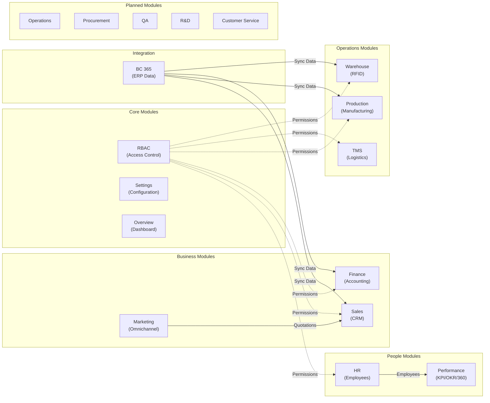

---

## 5. External Integrations

### 5.1 Microsoft Dynamics 365 Business Central

| รายการ | รายละเอียด |
|--------|-----------|
| **Authentication** | OAuth2 Client Credentials Flow |
| **Protocol** | OData V4 (REST) |
| **Sync Frequency** | Hourly (Vercel Cron) + Manual trigger จากหน้า Settings |
| **Sync Pipeline** | 6-phase sequential: Dimension Values -> Customers -> Items -> Sales Orders + Lines -> Production Orders + Item Ledger Entries -> Cleanup |
| **Data Direction** | One-way: BC -> Supabase (read-only sync) |
| **Batch Processing** | Batch upsert ครั้งละ 1,000 rows, concurrency 3 batches |
| **Safety Check** | ถ้า sync ได้ข้อมูลน้อยกว่า 50% ของข้อมูลเดิม จะข้าม cleanup เพื่อป้องกันการลบข้อมูลผิดพลาด |
| **Timeout** | maxDuration 300 วินาที (5 นาที), แต่ละ OData call timeout 120-180 วินาที |
| **Streaming** | รองรับ SSE streaming สำหรับ sync แบบ real-time progress |
| **Tables Synced** | `bcCustomer`, `bcItem`, `bcSalesOrder`, `bcSalesOrderLine`, `bcProductionOrder`, `bcItemLedgerEntry` |

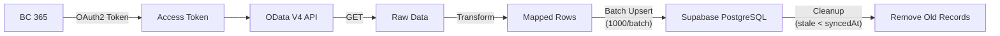

### 5.2 LINE Messaging API

| รายการ | รายละเอียด |
|--------|-----------|
| **Webhook URL** | `/api/marketing/omnichannel/webhooks/line` |
| **Signature Verification** | HMAC-SHA256 ใช้ `LINE_CHANNEL_SECRET`, เปรียบเทียบ Base64 |
| **Inbound** | รับ text messages, stickers, images จากลูกค้า |
| **Outbound** | Push messages ผ่าน LINE Messaging API ใช้ `Channel Access Token` |
| **Image Handling** | ดาวน์โหลดรูปจาก LINE Content API แล้วเก็บใน Supabase Storage |
| **Profile Caching** | Cache LINE profile ไว้ 5 นาทีเพื่อลด API calls |
| **De-duplication** | ตรวจ `omMessageExternalId` ป้องกันข้อความซ้ำจาก LINE redeliver |
| **AI Auto-Reply** | เมื่อเปิด auto-reply จะ trigger `/api/.../ai/reply` เพื่อตอบอัตโนมัติ |

### 5.3 Facebook Messenger API

| รายการ | รายละเอียด |
|--------|-----------|
| **Webhook URL** | `/api/marketing/omnichannel/webhooks/facebook` |
| **Verification** | GET request ตรวจ `hub.verify_token` สำหรับ webhook subscription |
| **Signature Verification** | HMAC-SHA256 ใช้ `FACEBOOK_APP_SECRET`, ตรวจ header `x-hub-signature-256` |
| **Inbound** | รับ text messages และ image attachments |
| **Outbound** | ส่งข้อความผ่าน Facebook Graph API |
| **Image Handling** | ดาวน์โหลด image attachment แล้วเก็บใน Supabase Storage |
| **AI Auto-Reply** | ใช้ trigger เดียวกับ LINE |

### 5.4 OpenRouter AI

| รายการ | รายละเอียด |
|--------|-----------|
| **Provider** | OpenRouter API |
| **Model** | Google Gemini 2.5 Flash Lite (multi-model support) |
| **Use Cases** | (1) Omnichannel Chat auto-reply, (2) OCR สลิปการโอนเงิน, (3) สรุปออเดอร์จากแชทเพื่อสร้างใบเสนอราคา, (4) Finance AI Analysis |
| **Debounce** | รอ 1 วินาทีก่อนตอบ เพื่อรวมข้อความที่ส่งรัวๆ |
| **Safety** | ตรวจว่าข้อความล่าสุดยังเป็นของลูกค้าก่อนตอบ (ไม่ตอบทับ agent) |
| **Handoff** | ปิด auto-reply อัตโนมัติเมื่อได้รับสลิปโอนเงิน (ส่งต่อให้ staff) |

### 5.5 Chainway CP30 RFID Printer

| รายการ | รายละเอียด |
|--------|-----------|
| **Connection** | TCP/IP Socket ผ่าน Node.js `net` module |
| **Address** | `192.168.1.43:9100` (configurable) |
| **Protocol** | ZPL (Zebra Programming Language) |
| **Print Method** | Thermal Transfer (`^MTT`) |
| **Thai Text** | Render เป็น bitmap ผ่าน `node-canvas` แล้วส่งเป็น `^GFA` command (ZPL font ไม่รองรับภาษาไทย) |
| **RFID Encoding** | 96-bit EPC, encode ผ่าน `^RS8` + `^RFW,H` commands |
| **Library** | `src/lib/chainWay/` -- config, utils, epc, printer, zpl, server |
| **API Endpoint** | `/api/warehouse/print` |

---

## 6. Security Architecture

### 6.1 Authentication

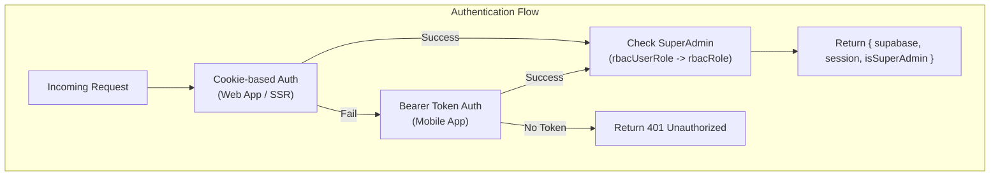

**รายละเอียด:**

- **Web App (Cookie SSR):** ใช้ `@supabase/ssr` สร้าง Supabase client จาก cookie ของ request โดยอัตโนมัติ
- **Mobile App (Bearer Token):** ตรวจ header `Authorization: Bearer {token}` แล้วสร้าง Supabase client ด้วย token นั้น
- **Dual Mode:** ฟังก์ชัน `withAuth()` ใน `src/app/api/_lib/auth.js` ลอง cookie ก่อน หากไม่สำเร็จจึง fallback ไป Bearer token
- **ทุก API Route** เรียก `withAuth()` เป็นสิ่งแรก แล้วได้ `{ supabase, session, isSuperAdmin }` กลับมา

### 6.2 RBAC (Role-Based Access Control)

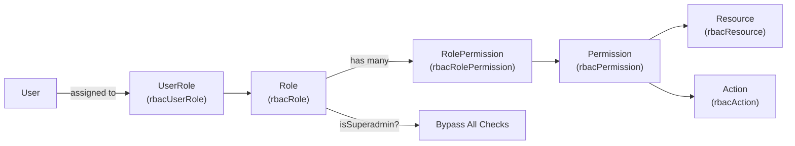

**การทำงาน:**

| องค์ประกอบ | รายละเอียด |
|-----------|-----------|
| **User** | ผู้ใช้จาก Supabase Auth |
| **Role** | บทบาท เช่น Admin, Manager, Staff -- มี flag `rbacRoleIsSuperadmin` |
| **Permission** | สิทธิ์ = Resource + Action เช่น `hr:employees` + `read` |
| **Resource** | ทรัพยากรในระบบ เช่น `hr:employees`, `sales:leads`, `it:tickets` |
| **Action** | การกระทำ เช่น `read`, `create`, `update`, `delete` |
| **Superadmin** | ข้ามการตรวจสิทธิ์ทั้งหมด |

### 6.3 PIN Login

| รายการ | รายละเอียด |
|--------|-----------|
| **Format** | ตัวเลข 6 หลัก |
| **Storage** | bcrypt hash เก็บใน Supabase Auth `app_metadata.pinHash` |
| **Lockout** | ใส่ผิด 5 ครั้ง ล็อค 15 นาที (`pinLockedUntil`) |
| **Counter** | `pinFailedAttempts` นับจำนวนครั้งที่ผิด รีเซ็ตเมื่อสำเร็จ |

### 6.4 Session Management

| รายการ | รายละเอียด |
|--------|-----------|
| **Inactivity Timeout** | 30 นาที -- ระบบ logout อัตโนมัติเมื่อไม่มีการใช้งาน |
| **Background Validation** | ตรวจสอบ session ทุก 1 นาที ในพื้นหลัง |
| **Cookie** | Supabase Auth cookie (HttpOnly, Secure, SameSite) |

### 6.5 Webhook Security

| Channel | วิธีตรวจสอบ |
|---------|-----------|
| **LINE** | HMAC-SHA256 ด้วย `LINE_CHANNEL_SECRET`, เปรียบเทียบ Base64 signature จาก header `x-line-signature` |
| **Facebook** | HMAC-SHA256 ด้วย `FACEBOOK_APP_SECRET`, เปรียบเทียบ hex signature จาก header `x-hub-signature-256` |
| **Internal API** | header `x-internal-secret` ตรวจกับ `INTERNAL_API_SECRET` สำหรับ internal service calls |
| **Cron** | header `Authorization: Bearer {CRON_SECRET}` สำหรับ scheduled sync |

---

## 7. Design Patterns

### 7.1 Module-Based File Structure

```
src/
  app/
    (main)/
      {module}/                 # Route groups (hr, sales, it, tms, ...)
        {subpage}/
          page.jsx              # Page component (thin wrapper)
    api/
      {module}/
        {resource}/
          route.js              # API Route (GET, POST)
          [id]/
            route.js            # API Route (GET, PUT, DELETE by ID)
  modules/
    {module}/
      components/
        {Resource}View.jsx      # View component (presentation)
      hooks/
        use{Resource}.js        # Custom hook (data logic)
  components/
    ui/
      DataTable.jsx             # Shared DataTable component
  lib/
    supabase/                   # Supabase client (server/client)
    chainWay/                   # RFID Printer library
    bcClient.js                 # BC 365 OData client
    omnichannel/                # Omnichannel utilities (AI, image, sender)
```

### 7.2 Page -> Hook -> View Pattern

ทุกหน้าใช้รูปแบบเดียวกัน: **Page** imports **Hook** สำหรับ data logic และ **View** สำหรับ presentation

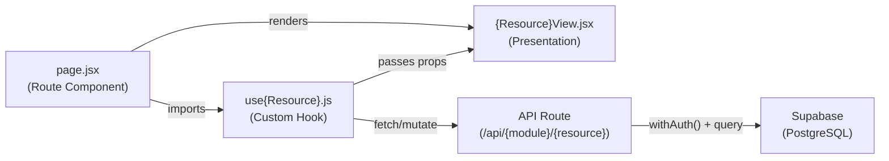

**ตัวอย่าง (HR Employees):**

| Layer | File | หน้าที่ |
|-------|------|--------|
| Page | `src/app/(main)/hr/employees/page.jsx` | Import hook + render view |
| Hook | `src/modules/hr/hooks/useEmployees.js` | State, CRUD logic, fetch data |
| View | `src/modules/hr/components/EmployeesView.jsx` | DataTable, forms, modals |
| API | `src/app/api/hr/employees/route.js` | GET (list), POST (create) |
| API | `src/app/api/hr/employees/[id]/route.js` | GET (one), PUT (update), DELETE (soft) |

### 7.3 DataTable Pattern

`DataTable` (`src/components/ui/DataTable.jsx`) เป็น shared component ที่ใช้ซ้ำกว่า 52+ views ทั่วทั้งระบบ รองรับทั้ง table view (desktop) และ card view (mobile) พร้อม features:

- Sorting, Filtering, Search
- Pagination
- Column visibility toggle
- Export
- Responsive (table/card toggle)

### 7.4 API Route Pattern

ทุก API route ใช้รูปแบบมาตรฐานเดียวกัน:

```javascript
// Standard API Route Pattern
export async function GET(request) {
  const auth = await withAuth();                    // 1. Authenticate
  if (auth.error) return auth.error;                // 2. Return 401 if unauthorized
  const { supabase, session, isSuperAdmin } = auth; // 3. Destructure

  // 4. Business logic with supabase client
  const { data, error } = await supabase
    .from("tableName")
    .select("*")
    .eq("isActive", true);

  if (error) return Response.json({ error: error.message }, { status: 500 });
  return Response.json(data);
}
```

### 7.5 Soft Delete Pattern

ระบบใช้ **Soft Delete** แทน Hard Delete ทุกตาราง -- ใช้ field `isActive` (boolean):

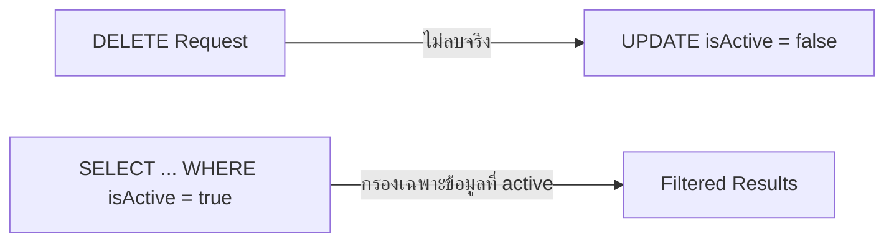

- **DELETE endpoint:** `UPDATE SET isActive = false` แทนการลบ
- **GET endpoint:** `WHERE isActive = true` กรองเฉพาะข้อมูลที่ยัง active
- **ข้อดี:** สามารถกู้คืนข้อมูลได้, มี audit trail, ไม่เสีย foreign key integrity

---

## Appendix: Environment Variables

| Variable | ใช้กับ | รายละเอียด |
|----------|-------|-----------|
| `NEXT_PUBLIC_SUPABASE_URL` | Supabase | URL ของ Supabase project |
| `NEXT_PUBLIC_SUPABASE_PUBLISHABLE_DEFAULT_KEY` | Supabase | Anon/public key |
| `SUPABASE_SERVICE_ROLE_KEY` | Supabase | Service role key (server-side only) |
| `LINE_CHANNEL_SECRET` | LINE | สำหรับ HMAC signature verification |
| `LINE_CHANNEL_ACCESS_TOKEN` | LINE | สำหรับ push messages |
| `FACEBOOK_APP_SECRET` | Facebook | สำหรับ HMAC signature verification |
| `FACEBOOK_WEBHOOK_VERIFY_TOKEN` | Facebook | สำหรับ webhook subscription verification |
| `FACEBOOK_PAGE_ACCESS_TOKEN` | Facebook | สำหรับ send messages |
| `OPENROUTER_API_KEY` | OpenRouter | สำหรับ AI model API calls |
| `INTERNAL_API_SECRET` | Internal | สำหรับ internal service-to-service calls |
| `CRON_SECRET` | Vercel Cron | สำหรับ authenticated cron jobs |
| `NEXT_PUBLIC_APP_URL` | General | Base URL ของแอปพลิเคชัน |
