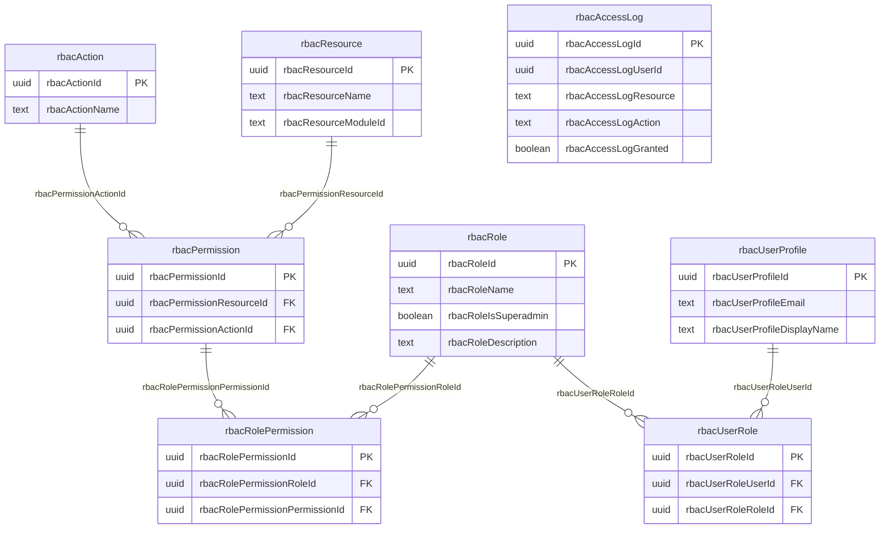
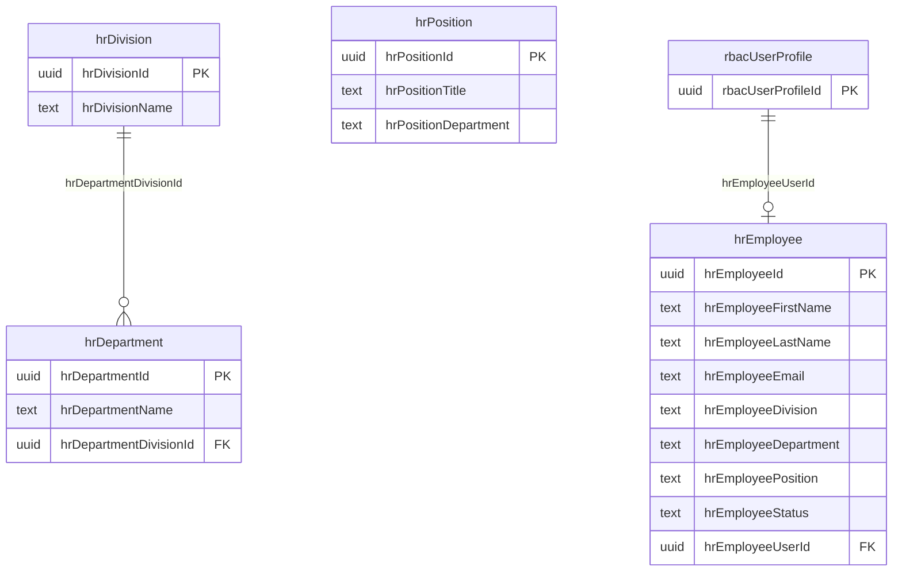
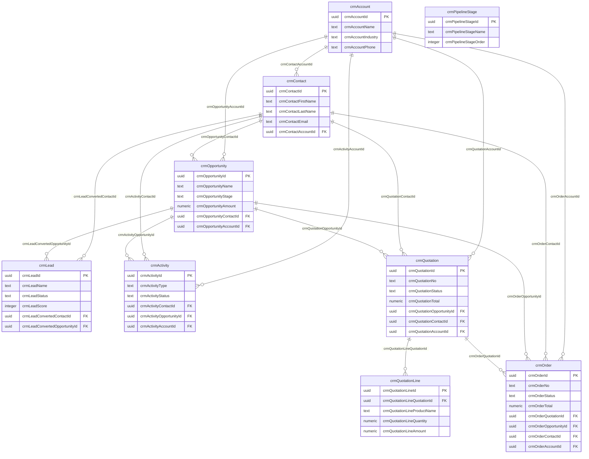
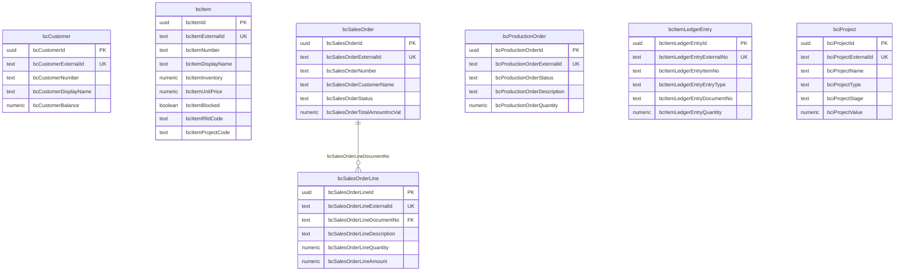
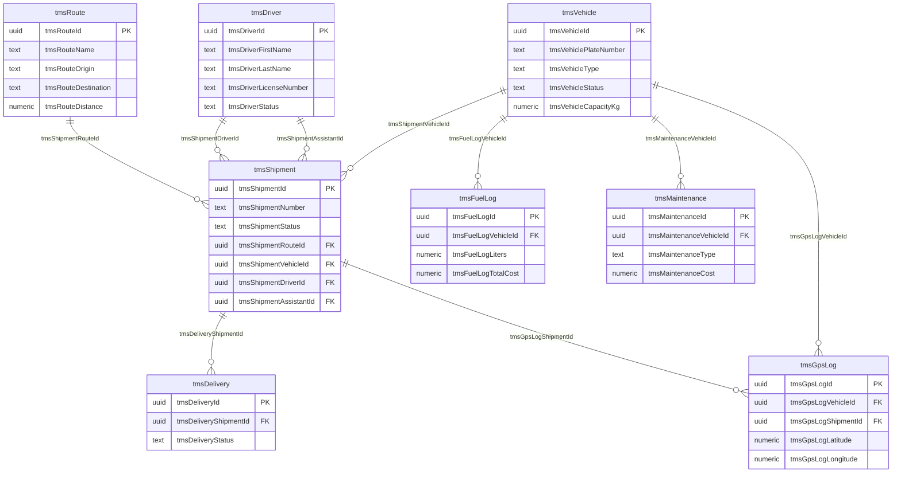
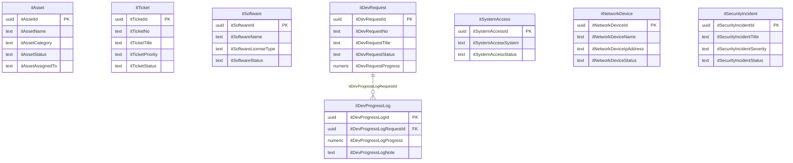
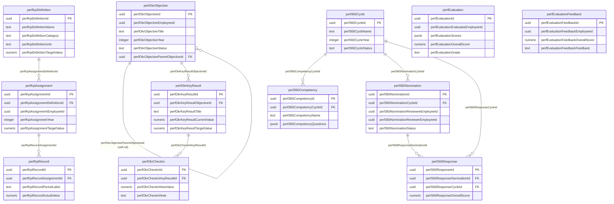
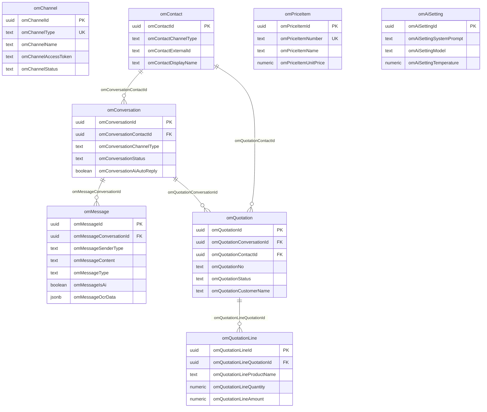
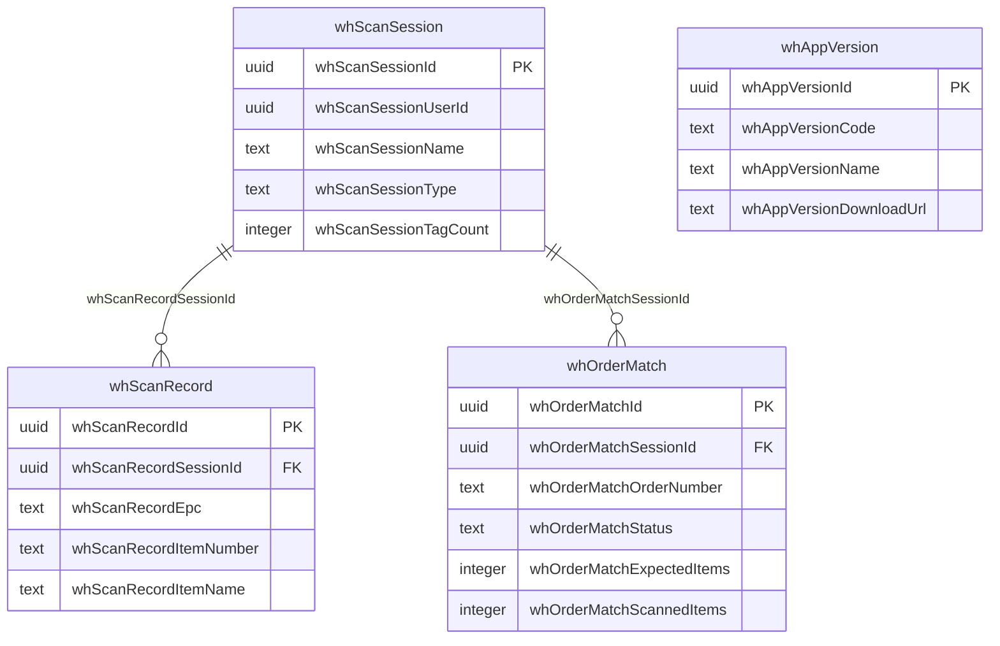

# Entity Relationship Diagrams

แผนภาพความสัมพันธ์ระหว่างตาราง (ERD) ของระบบ Evergreen ERP แบ่งตามโมดูลหลัก

---

## 1. RBAC & Auth -- ระบบจัดการสิทธิ์และการเข้าถึง

ระบบ Role-Based Access Control สำหรับจัดการสิทธิ์ผู้ใช้งาน ประกอบด้วย Role, Resource, Action และ Permission โดยแต่ละ Role จะถูกกำหนด Permission ที่เป็นคู่ของ Resource + Action ผู้ใช้งานสามารถมีหลาย Role และระบบจะบันทึก Access Log ทุกครั้งที่มีการเข้าถึงทรัพยากร

---

## 2. HR -- ระบบบริหารทรัพยากรบุคคล

โครงสร้างองค์กรแบ่งเป็น Division > Department > Position โดยพนักงาน (Employee) จะสังกัดหน่วยงานและตำแหน่ง และสามารถเชื่อมโยงกับบัญชีผู้ใช้งาน (rbacUserProfile) ในระบบได้

---

## 3. Sales / CRM -- ระบบบริหารลูกค้าสัมพันธ์และการขาย

ระบบ CRM ครอบคลุมตั้งแต่การจัดการบัญชีลูกค้า (Account), ผู้ติดต่อ (Contact), Lead, โอกาสทางการขาย (Opportunity), ใบเสนอราคา (Quotation) จนถึงใบสั่งขาย (Order) โดย Lead สามารถแปลงเป็น Contact และ Opportunity ได้ กิจกรรม (Activity) ใช้บันทึกการติดต่อลูกค้าทุกรูปแบบ

---

## 4. BC Data -- ข้อมูลจาก Business Central

ข้อมูลที่ซิงค์จากระบบ Microsoft Dynamics 365 Business Central ผ่าน OData ประกอบด้วยลูกค้า (Customer), สินค้า (Item), ใบสั่งขาย (Sales Order), ใบสั่งผลิต (Production Order), รายการเคลื่อนไหวสินค้า (Item Ledger Entry) และโปรเจกต์ โดยแต่ละ record มี externalId สำหรับอ้างอิงกลับไปยัง BC

---

## 5. TMS -- ระบบจัดการการขนส่ง

ระบบบริหารการขนส่งครอบคลุมยานพาหนะ (Vehicle), คนขับ (Driver), เส้นทาง (Route) และการจัดส่ง (Shipment/Delivery) รวมถึงการบันทึกเชื้อเพลิง (Fuel Log), การซ่อมบำรุง (Maintenance) และ GPS Tracking

---

## 6. IT -- ระบบบริหารจัดการไอที

โมดูล IT ครอบคลุมการจัดการทรัพย์สินไอที (Asset), Helpdesk Ticket, ซอฟต์แวร์และ License, คำร้องพัฒนาระบบ (Dev Request) พร้อม Progress Log, การจัดการสิทธิ์เข้าถึงระบบ (System Access), อุปกรณ์เครือข่าย (Network Device) และเหตุการณ์ด้านความปลอดภัย (Security Incident)

---

## 7. Performance -- ระบบประเมินผลงาน

ระบบประเมินผลงานครอบคลุม 3 เครื่องมือหลัก:
- **KPI**: กำหนด KPI Definition แล้วมอบหมาย (Assignment) ให้พนักงาน บันทึกผลจริงผ่าน KPI Record
- **OKR**: ตั้ง Objective (รองรับ parent-child แบบ cascade) แตกเป็น Key Result แล้ว Check-in ความคืบหน้า
- **360 Feedback**: สร้าง Cycle กำหนด Competency ที่ต้องประเมิน จากนั้น Nominate ผู้ประเมิน/ผู้ถูกประเมิน และเก็บ Response

ผลประเมินรวมจะถูกสรุปใน perfEvaluation และ perfEvaluationFeedback

---

## 8. Omnichannel -- ระบบสื่อสารหลายช่องทาง

ระบบ Omnichannel รองรับการสื่อสารผ่านหลายช่องทาง (LINE, Facebook, Web Chat ฯลฯ) โดยแต่ละ Channel จะมี Contact ที่เข้ามาสนทนา (Conversation) และบันทึกข้อความ (Message) รวมถึงรองรับ AI Auto Reply ระบบยังสามารถสร้างใบเสนอราคา (Quotation) จากบทสนทนาได้โดยตรง และมี Price Item สำหรับอ้างอิงราคาสินค้า

---

## 9. Warehouse -- ระบบคลังสินค้าและ RFID

ระบบคลังสินค้ารองรับการสแกน RFID ผ่าน Scan Session โดยแต่ละ Session จะบันทึก Scan Record (EPC tag) และสามารถจับคู่กับใบสั่งขาย (Order Match) เพื่อตรวจสอบความถูกต้องของสินค้า ระบบยังจัดการเวอร์ชันของแอปพลิเคชัน (App Version) สำหรับอัปเดต

