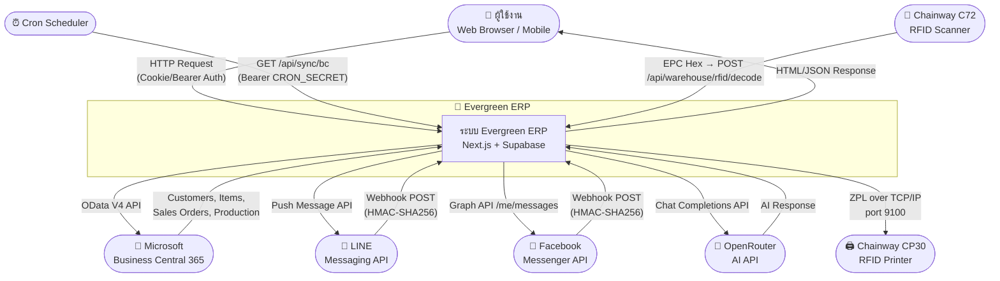
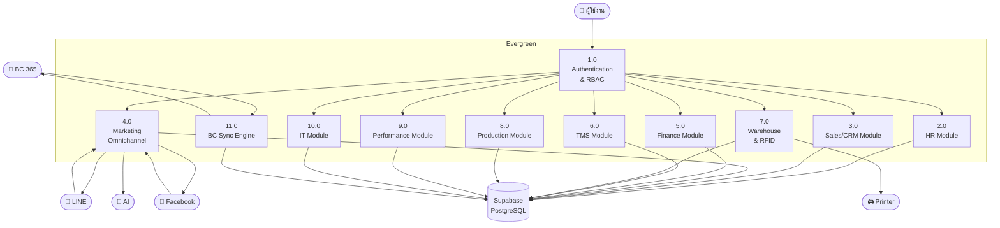
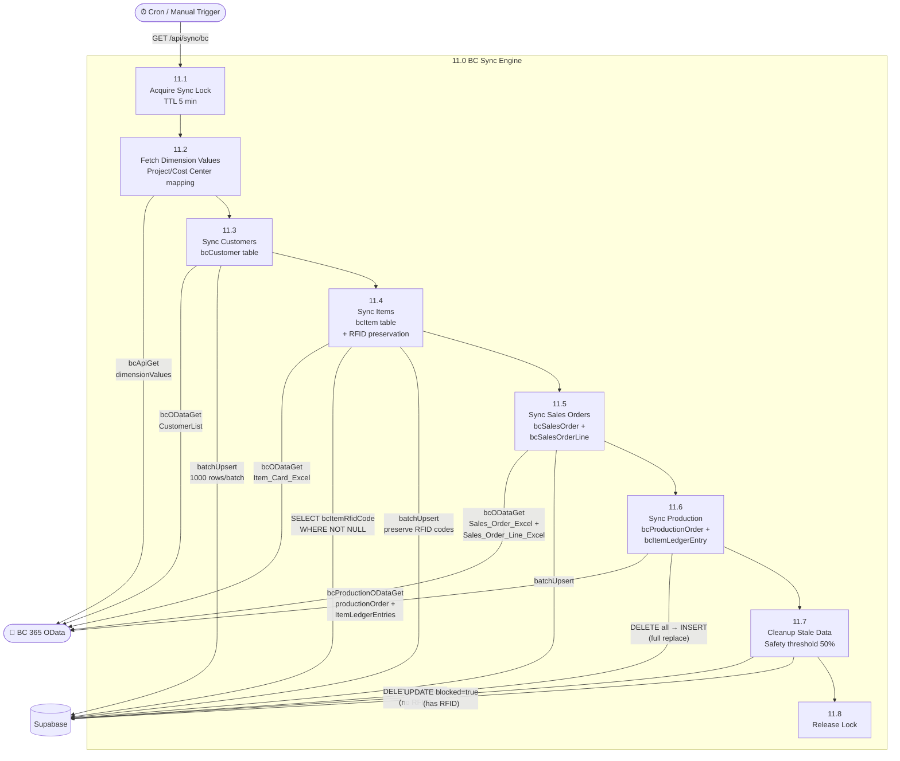
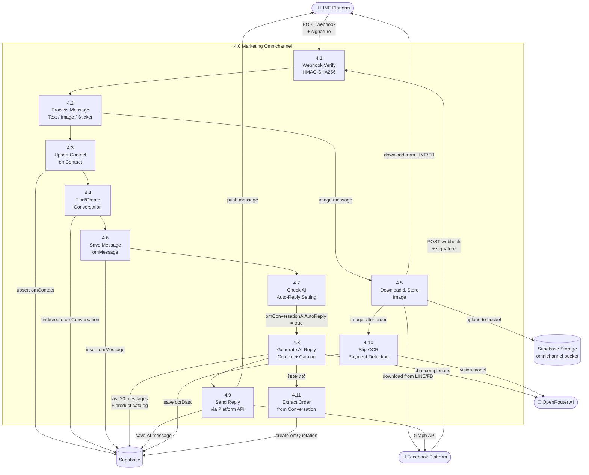
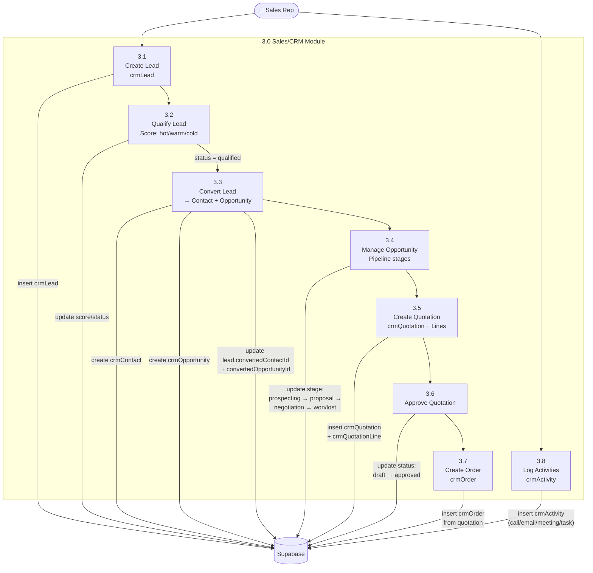
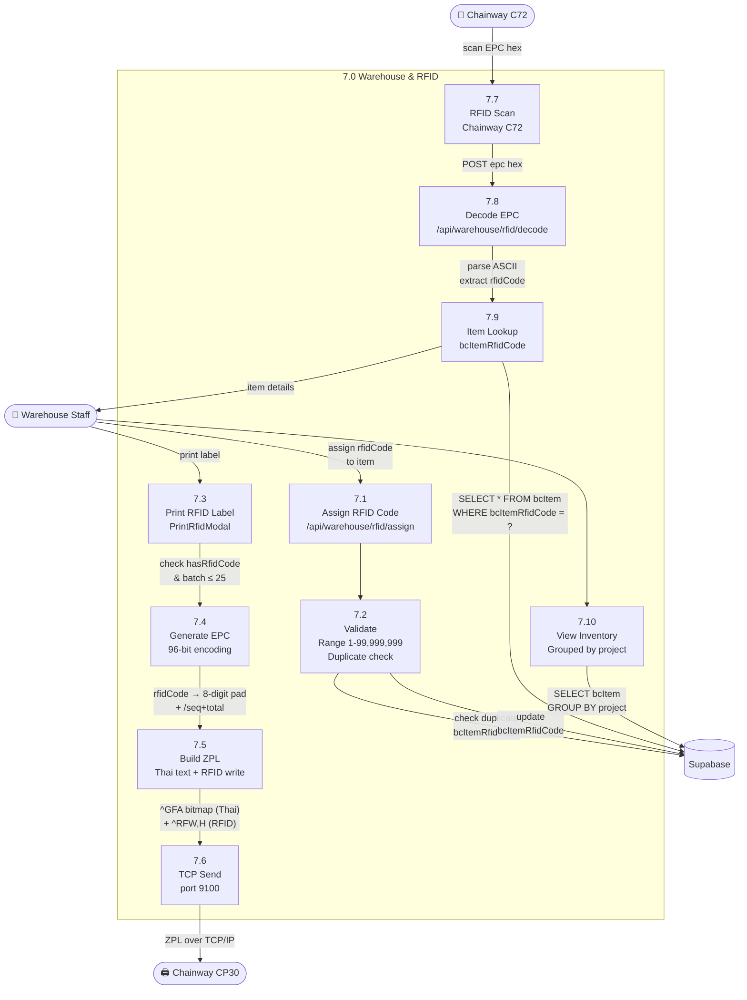
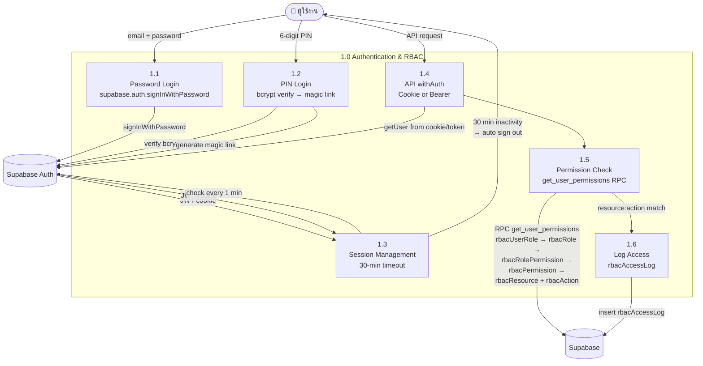
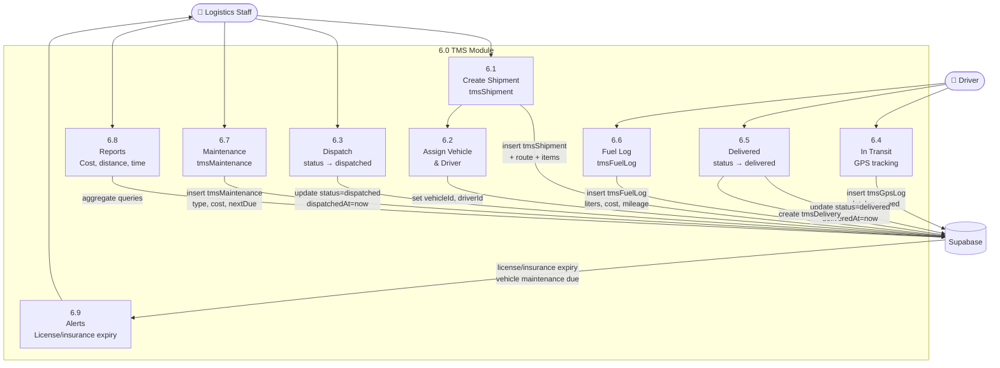
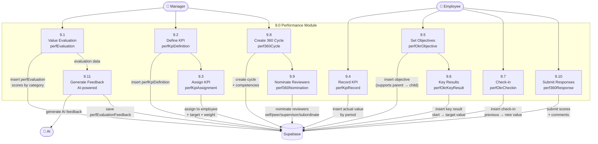

# Data Flow Diagrams (DFD)

เอกสาร Data Flow Diagram แสดงการไหลของข้อมูลในระบบ Evergreen ERP

---

## 1. Context Diagram (Level 0)

แสดงภาพรวมระบบ Evergreen กับ external entities ทั้งหมด

---

## 2. Level 1 DFD — Main System Processes

---

## 3. Level 2 DFD — BC Sync Flow

แสดงกระบวนการ Sync ข้อมูลจาก Business Central 365

---

## 4. Level 2 DFD — Omnichannel Message Flow

แสดงการรับ-ส่งข้อความผ่าน LINE/Facebook

---

## 5. Level 2 DFD — Sales Pipeline Flow

แสดงขั้นตอนการขายจาก Lead ถึง Order

---

## 6. Level 2 DFD — RFID/Warehouse Flow

แสดงกระบวนการจัดการ RFID ในคลังสินค้า

---

## 7. Level 2 DFD — Auth & RBAC Flow

แสดงกระบวนการ Authentication และ Permission Check

---

## 8. Level 2 DFD — TMS Shipment Flow

แสดงกระบวนการจัดส่งสินค้า

---

## 9. Level 2 DFD — Performance Management Flow

