# Use Case Diagrams

เอกสาร Use Case แสดงผู้ใช้งาน (Actors) และกรณีการใช้งาน (Use Cases) ของระบบ Evergreen ERP

---

## 1. Actors (ผู้ใช้งานระบบ)

| Actor | คำอธิบาย | Modules ที่เข้าถึง |
|-------|----------|-------------------|
| **Admin** | ผู้ดูแลระบบ มีสิทธิ์ superadmin | ทุก module + RBAC + Settings |
| **HR Manager** | ผู้จัดการฝ่ายบุคคล | HR, Performance |
| **Sales Rep** | พนักงานขาย | Sales/CRM |
| **Marketing Staff** | พนักงานการตลาด | Marketing, Omnichannel |
| **IT Staff** | เจ้าหน้าที่ IT | IT |
| **Finance Staff** | พนักงานการเงิน | Finance |
| **Warehouse Staff** | เจ้าหน้าที่คลังสินค้า | Warehouse, RFID |
| **Driver** | พนักงานขับรถ | TMS (mobile) |
| **Production Manager** | ผู้จัดการฝ่ายผลิต | Production |
| **Employee** | พนักงานทั่วไป | Profile, Performance (self-service) |
| **Customer** | ลูกค้า (external) | LINE/Facebook chat |
| **Cron** | ระบบ scheduler อัตโนมัติ | BC Sync |

---

## 2. RBAC & Authentication

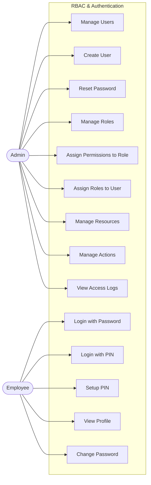

### Use Case Details

| ID | Use Case | Actor | คำอธิบาย |
|----|----------|-------|----------|
| UC1 | Login with Password | Employee | เข้าสู่ระบบด้วย email + password |
| UC2 | Login with PIN | Employee | เข้าสู่ระบบด้วย PIN 6 หลัก (ต้อง login ด้วย password ก่อน 1 ครั้ง) |
| UC3 | Manage Users | Admin | ดูรายการผู้ใช้, link กับพนักงาน |
| UC4 | Create User | Admin | สร้างผู้ใช้ใหม่ (email + password) |
| UC5 | Reset Password | Admin | รีเซ็ตรหัสผ่านผู้ใช้ |
| UC6 | Manage Roles | Admin | CRUD บทบาท, กำหนด superadmin |
| UC7 | Assign Permissions | Admin | เลือก permission (Resource:Action) ให้กับ Role |
| UC8 | Assign Roles | Admin | กำหนด Role ให้กับ User |
| UC9 | Manage Resources | Admin | CRUD ทรัพยากร (modules) |
| UC10 | Manage Actions | Admin | CRUD การดำเนินการ (create/read/update/delete) |
| UC11 | View Access Logs | Admin | ดูประวัติการเข้าถึงระบบ |
| UC12 | Setup PIN | Employee | ตั้งค่า/ลบ PIN สำหรับ quick login |
| UC13 | View Profile | Employee | ดูข้อมูลโปรไฟล์ของตัวเอง |
| UC14 | Change Password | Employee | เปลี่ยนรหัสผ่าน |

---

## 3. HR Module

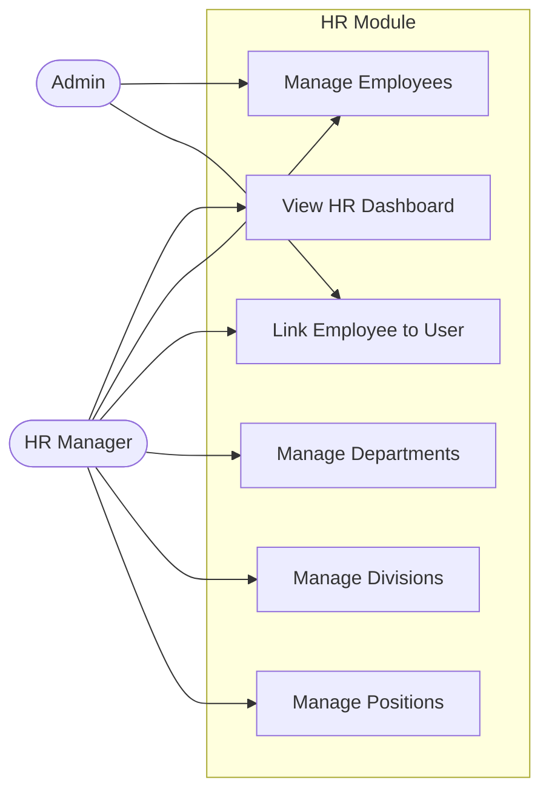

| ID | Use Case | คำอธิบาย |
|----|----------|----------|
| UC20 | View HR Dashboard | ดูภาพรวม HR: จำนวนพนักงาน, สถิติ |
| UC21 | Manage Employees | CRUD พนักงาน (ชื่อ, อีเมล, แผนก, ตำแหน่ง, สถานะ) |
| UC22 | Link Employee to User | เชื่อมพนักงานกับบัญชีผู้ใช้ระบบ |
| UC23 | Manage Departments | CRUD แผนก, เชื่อมกับฝ่าย |
| UC24 | Manage Divisions | CRUD ฝ่าย |
| UC25 | Manage Positions | CRUD ตำแหน่ง |

---

## 4. Sales/CRM Module

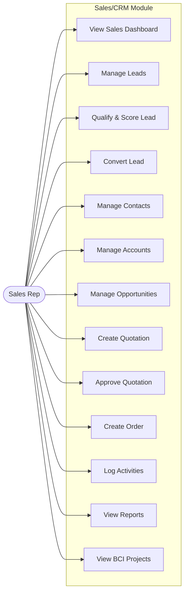

| ID | Use Case | คำอธิบาย |
|----|----------|----------|
| UC30 | View Sales Dashboard | ดูภาพรวมการขาย: pipeline, revenue, conversion |
| UC31 | Manage Leads | CRUD ลีด (ชื่อ, บริษัท, แหล่งที่มา) |
| UC32 | Qualify & Score Lead | ให้คะแนน lead (hot/warm/cold) + เปลี่ยนสถานะ |
| UC33 | Convert Lead | แปลง Lead → Contact + Opportunity |
| UC34 | Manage Contacts | CRUD ผู้ติดต่อ, เชื่อมกับ Account |
| UC35 | Manage Accounts | CRUD บัญชีลูกค้า |
| UC36 | Manage Opportunities | จัดการโอกาสขาย, เลื่อน pipeline stage |
| UC37 | Create Quotation | สร้างใบเสนอราคา + รายการสินค้า |
| UC38 | Approve Quotation | อนุมัติ/ปฏิเสธใบเสนอราคา |
| UC39 | Create Order | สร้างคำสั่งซื้อจากใบเสนอราคา |
| UC40 | Log Activities | บันทึกกิจกรรม (โทร, อีเมล, ประชุม, งาน) |
| UC41 | View Reports | ดูรายงานการขาย |
| UC42 | View BCI Projects | ดูข้อมูลโปรเจค BCI (import จากภายนอก) |

---

## 5. Marketing / Omnichannel Module

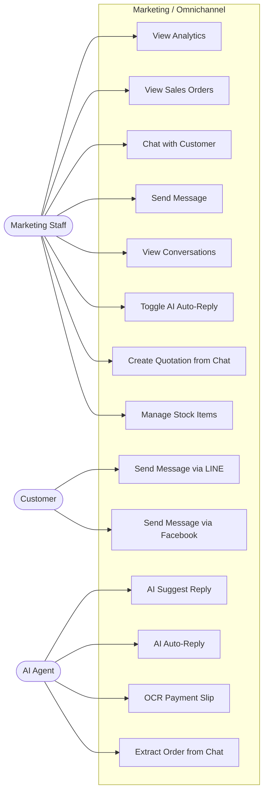

| ID | Use Case | คำอธิบาย |
|----|----------|----------|
| UC50 | View Analytics | ดูสถิติการตลาด |
| UC51 | View Sales Orders | ดูคำสั่งขายจาก BC |
| UC52 | Chat with Customer | แชทกับลูกค้าแบบ real-time (LINE/Facebook) |
| UC53 | Send Message | ส่งข้อความตอบลูกค้า |
| UC54 | View Conversations | ดูรายการสนทนาทั้งหมด |
| UC55 | Toggle AI Auto-Reply | เปิด/ปิด AI ตอบอัตโนมัติ |
| UC56 | Create Quotation from Chat | สร้างใบเสนอราคาจากบทสนทนา |
| UC57 | Manage Stock Items | จัดการรายการราคาสินค้า |
| UC58 | Send via LINE | ลูกค้าส่งข้อความผ่าน LINE |
| UC59 | Send via Facebook | ลูกค้าส่งข้อความผ่าน Facebook |
| UC60 | AI Suggest Reply | AI แนะนำข้อความตอบกลับ |
| UC61 | AI Auto-Reply | AI ตอบลูกค้าอัตโนมัติ (ตอนเปิด toggle) |
| UC62 | OCR Payment Slip | AI อ่านสลิปโอนเงิน (จำนวน, ธนาคาร, วันเวลา) |
| UC63 | Extract Order | AI ดึงข้อมูลออเดอร์จากบทสนทนา |

---

## 6. IT Module

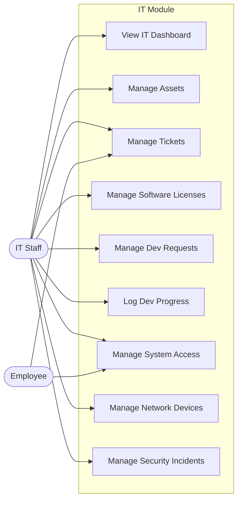

| ID | Use Case | คำอธิบาย |
|----|----------|----------|
| UC70 | View IT Dashboard | ดูภาพรวม IT: tickets, assets, สถานะ |
| UC71 | Manage Assets | CRUD ทรัพย์สิน IT (คอม, เครือข่าย, etc.) |
| UC72 | Manage Tickets | CRUD ตั๋วแจ้งปัญหา (priority, status, assign) |
| UC73 | Manage Software | CRUD ซอฟต์แวร์ (license key, วันหมดอายุ) |
| UC74 | Manage Dev Requests | CRUD คำขอพัฒนาระบบ (status, progress) |
| UC75 | Log Dev Progress | บันทึกความคืบหน้าการพัฒนา (%) |
| UC76 | Manage System Access | CRUD คำขอเข้าถึงระบบ (pending → approved/denied) |
| UC77 | Manage Network | CRUD อุปกรณ์เครือข่าย (IP, สถานะ) |
| UC78 | Manage Security | CRUD เหตุการณ์ด้านความปลอดภัย (severity) |

---

## 7. Finance Module

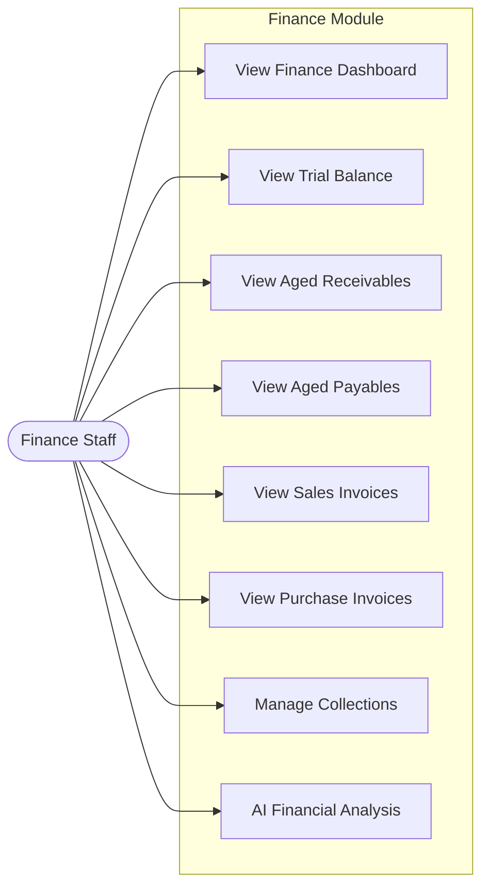

| ID | Use Case | คำอธิบาย |
|----|----------|----------|
| UC80 | View Finance Dashboard | ดูภาพรวมการเงิน |
| UC81 | View Trial Balance | ดูงบทดลอง (จาก BC) |
| UC82 | View Aged Receivables | ดูรายงานลูกหนี้ค้างชำระ (จาก BC) |
| UC83 | View Aged Payables | ดูรายงานเจ้าหนี้ค้างชำระ (จาก BC) |
| UC84 | View Sales Invoices | ดูใบแจ้งหนี้ขาย (จาก BC) |
| UC85 | View Purchase Invoices | ดูใบแจ้งหนี้ซื้อ (จาก BC) |
| UC86 | Manage Collections | จัดการติดตามลูกหนี้ (follow-up) |
| UC87 | AI Analysis | วิเคราะห์ข้อมูลการเงินด้วย AI |

---

## 8. TMS Module

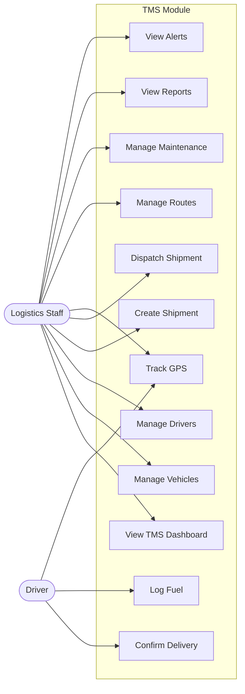

| ID | Use Case | คำอธิบาย |
|----|----------|----------|
| UC90 | View TMS Dashboard | ดูภาพรวมการขนส่ง |
| UC91 | Manage Vehicles | CRUD ยานพาหนะ (ทะเบียน, ประเภท, สถานะ, เอกสาร) |
| UC92 | Manage Drivers | CRUD คนขับ (ใบอนุญาต, ประเภท, วันหมดอายุ) |
| UC93 | Create Shipment | สร้างรายการขนส่ง (ลูกค้า, ปลายทาง, สินค้า) |
| UC94 | Dispatch Shipment | จัดรถ + คนขับ, เปลี่ยนสถานะ → dispatched |
| UC95 | Track GPS | ติดตามตำแหน่งยานพาหนะ real-time |
| UC96 | Confirm Delivery | ยืนยันการส่งมอบ → delivered |
| UC97 | Manage Routes | CRUD เส้นทาง (ต้นทาง, ปลายทาง, ระยะทาง) |
| UC98 | Log Fuel | บันทึกการเติมน้ำมัน (ลิตร, ราคา, เลขไมล์) |
| UC99 | Manage Maintenance | บันทึกซ่อมบำรุง (ประเภท, ค่าใช้จ่าย, กำหนดถัดไป) |
| UC100 | View Reports | ดูรายงาน (ต้นทุน, ระยะทาง, เวลา) |
| UC101 | View Alerts | ดูแจ้งเตือน (ใบอนุญาตหมดอายุ, ซ่อมบำรุง) |

---

## 9. Warehouse & RFID Module

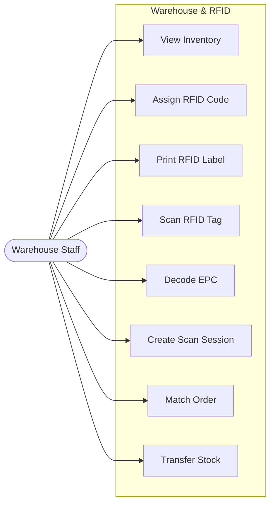

| ID | Use Case | คำอธิบาย |
|----|----------|----------|
| UC110 | View Inventory | ดูสินค้าคงเหลือ (จัดกลุ่มตาม project) |
| UC111 | Assign RFID Code | กำหนดเลข RFID Code ให้สินค้า (1-99,999,999, ไม่ซ้ำ) |
| UC112 | Print RFID Label | พิมพ์ label RFID (ต้อง assign code ก่อน, max 25/batch) |
| UC113 | Scan RFID Tag | สแกน RFID ด้วย Chainway C72 |
| UC114 | Decode EPC | ถอดรหัส EPC → item number + rfidCode |
| UC115 | Create Scan Session | เปิด session สแกน + บันทึกรายการ |
| UC116 | Match Order | จับคู่สินค้าสแกนกับคำสั่งซื้อ |
| UC117 | Transfer Stock | โอนย้ายสินค้าระหว่างคลัง |

---

## 10. Production Module

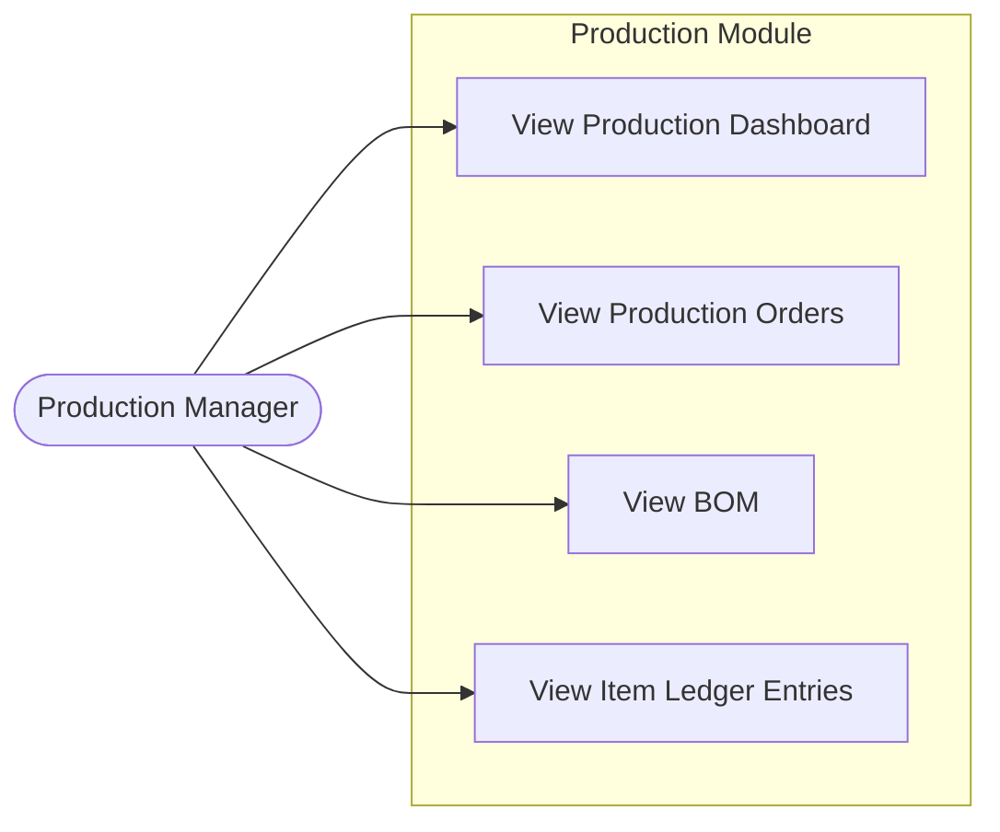

| ID | Use Case | คำอธิบาย |
|----|----------|----------|
| UC120 | View Dashboard | ดูภาพรวมการผลิต (จำนวน orders, สถานะ) |
| UC121 | View Production Orders | ดูใบสั่งผลิต (จาก BC, สถานะ, ปริมาณ) |
| UC122 | View BOM | ดู Bill of Materials (ส่วนประกอบ, ต้นทุน) |
| UC123 | View Entries | ดูรายการเคลื่อนไหว Consumption/Output (จาก BC) |

---

## 11. Performance Module

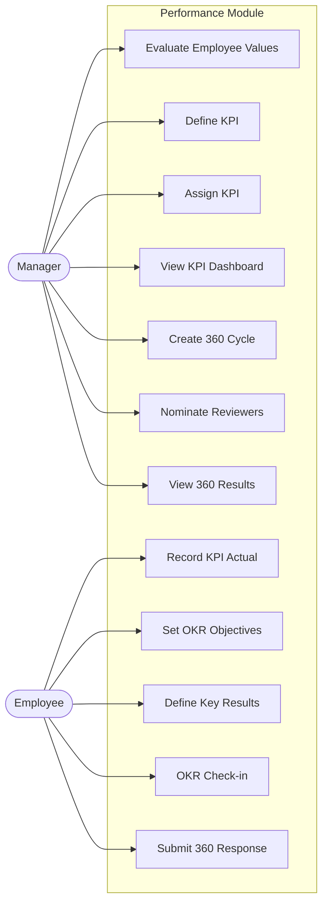

| ID | Use Case | คำอธิบาย |
|----|----------|----------|
| UC130 | Evaluate Values | ประเมินค่านิยมพนักงาน (คะแนนตามหมวด) |
| UC131 | Define KPI | กำหนด KPI (ชื่อ, หมวด, หน่วย, เป้าหมาย, เกณฑ์เตือน) |
| UC132 | Assign KPI | มอบหมาย KPI ให้พนักงาน (เป้า, น้ำหนัก, ปี) |
| UC133 | Record KPI | บันทึกค่าจริง KPI ตามรอบ |
| UC134 | View KPI Dashboard | ดูภาพรวม KPI ทั้งหมด |
| UC135 | Set Objectives | ตั้ง OKR Objectives (รองรับ parent-child hierarchy) |
| UC136 | Define Key Results | กำหนด Key Results (เริ่มต้น → เป้าหมาย) |
| UC137 | OKR Check-in | บันทึก check-in (ค่าเดิม → ค่าใหม่ + หมายเหตุ) |
| UC138 | Create 360 Cycle | สร้างรอบประเมิน 360 + competencies + คำถาม |
| UC139 | Nominate Reviewers | เสนอชื่อผู้ประเมิน (self/peer/supervisor/subordinate) |
| UC140 | Submit Response | ส่งคะแนน + ความเห็นประเมิน 360 |
| UC141 | View Results | ดูผลประเมิน 360 รวม |

---

## 12. Settings & BC Integration

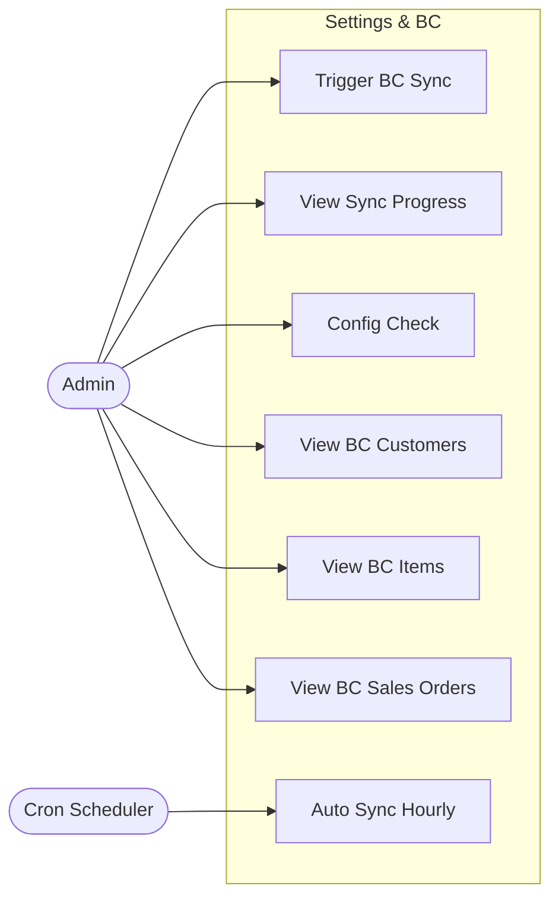

| ID | Use Case | คำอธิบาย |
|----|----------|----------|
| UC150 | Trigger BC Sync | สั่ง sync ข้อมูลจาก BC แบบ manual |
| UC151 | View Sync Progress | ดูความคืบหน้า sync แบบ real-time (SSE) |
| UC152 | Config Check | ตรวจสอบ configuration ของระบบ |
| UC153 | View BC Customers | ดูรายชื่อลูกค้าจาก BC |
| UC154 | View BC Items | ดูรายการสินค้าจาก BC |
| UC155 | View BC Sales Orders | ดูคำสั่งขายจาก BC |
| UC156 | Auto Sync | ระบบ sync อัตโนมัติทุก 1 ชั่วโมง |
