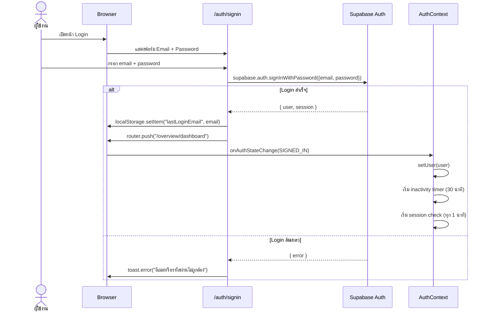
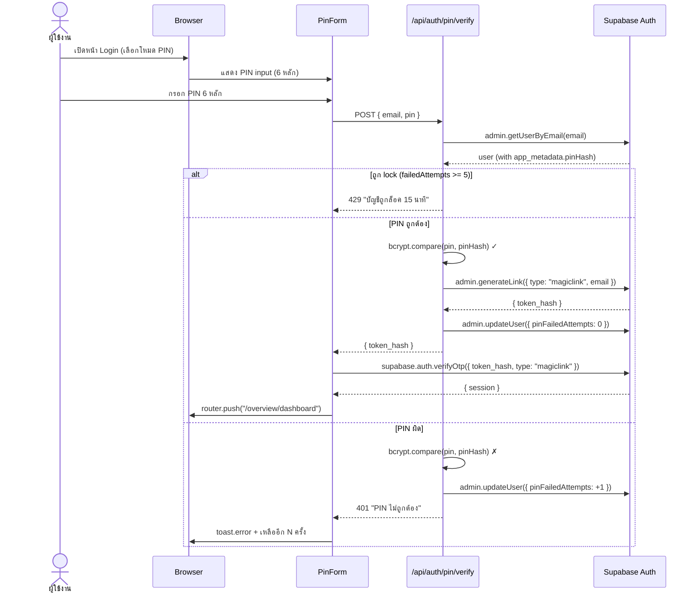
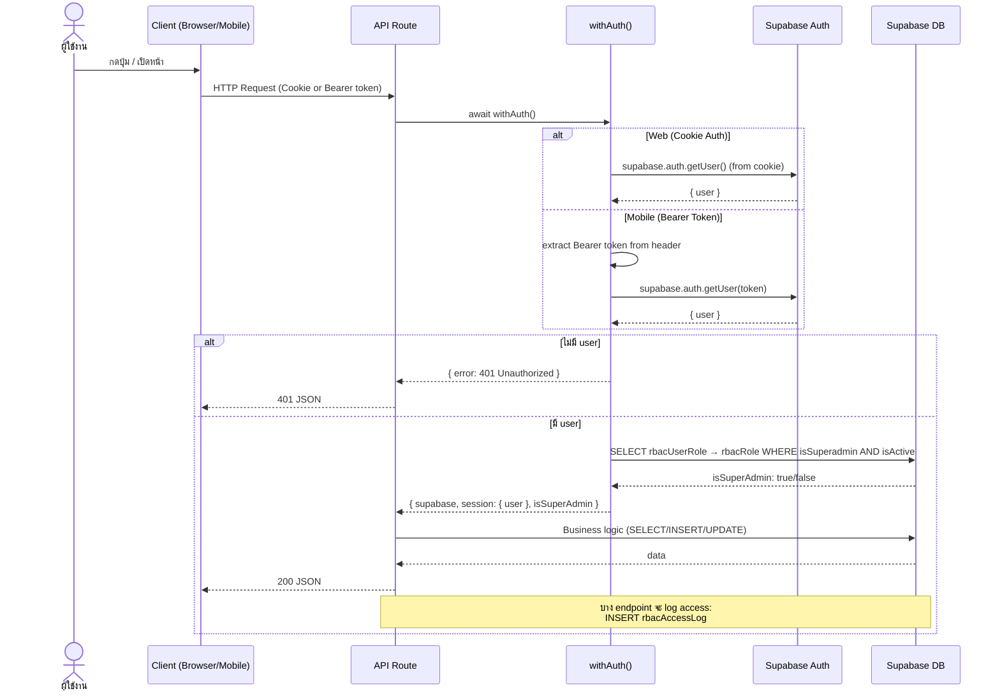
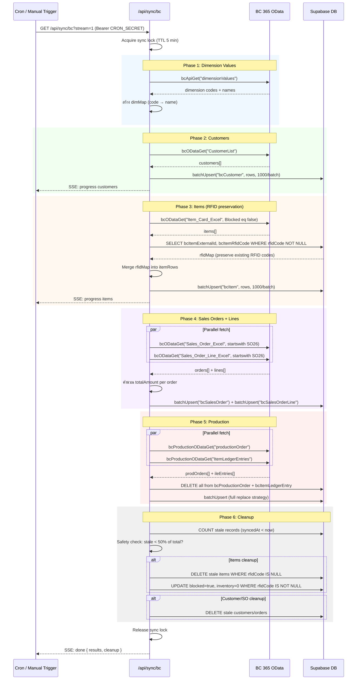
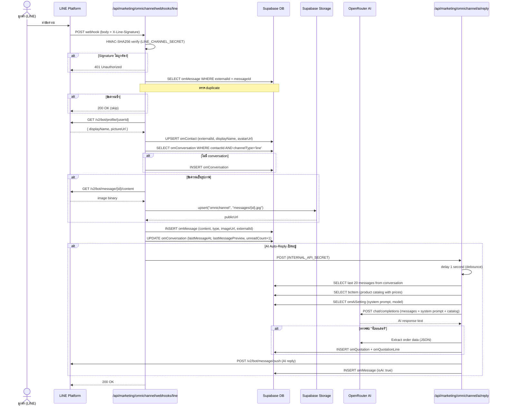
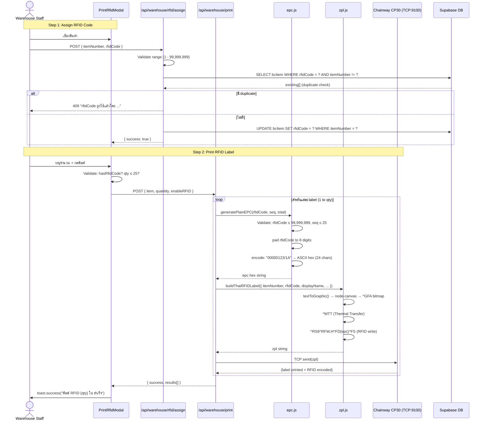
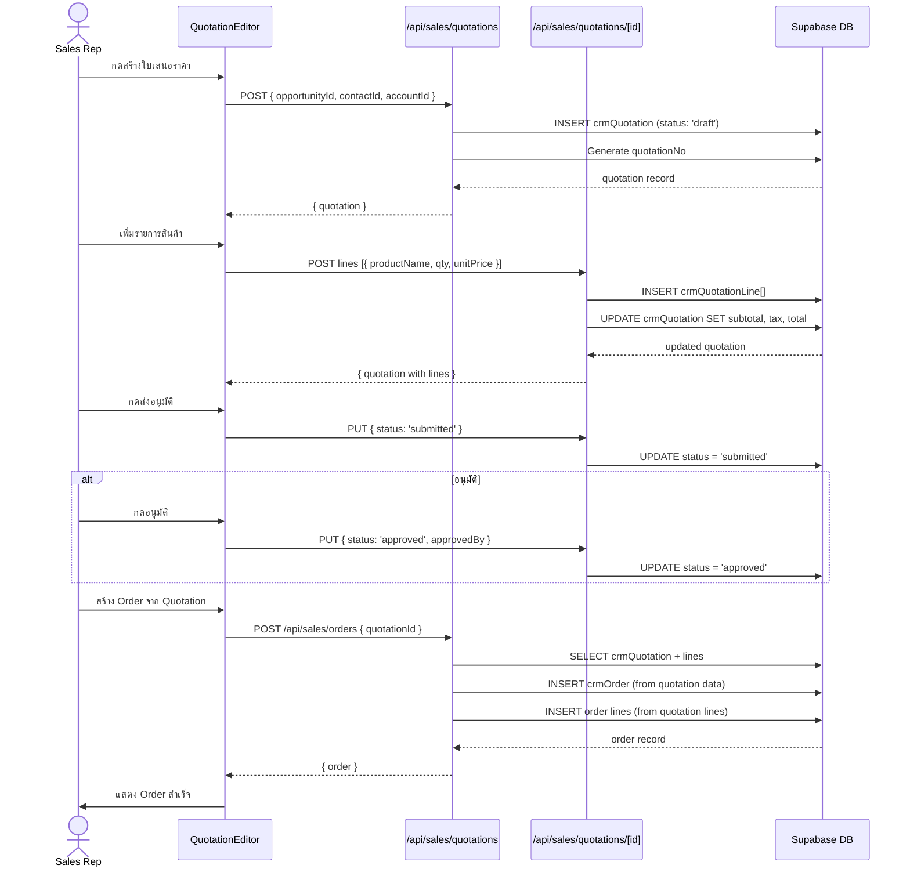
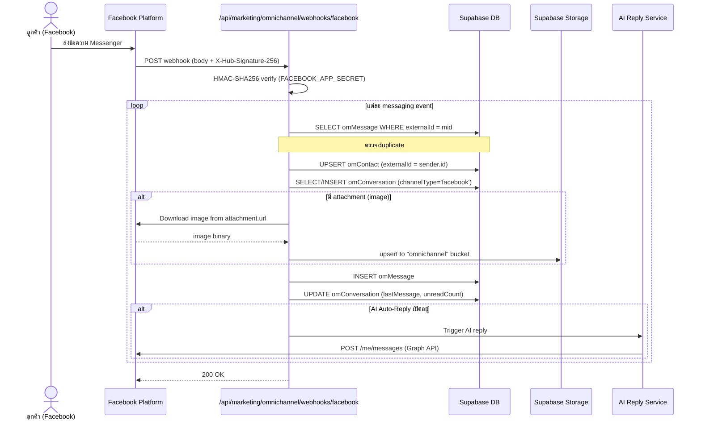
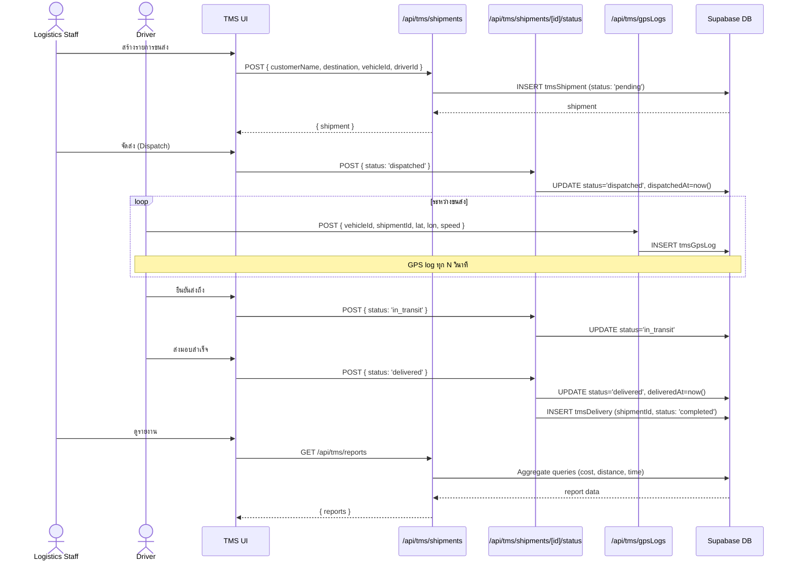
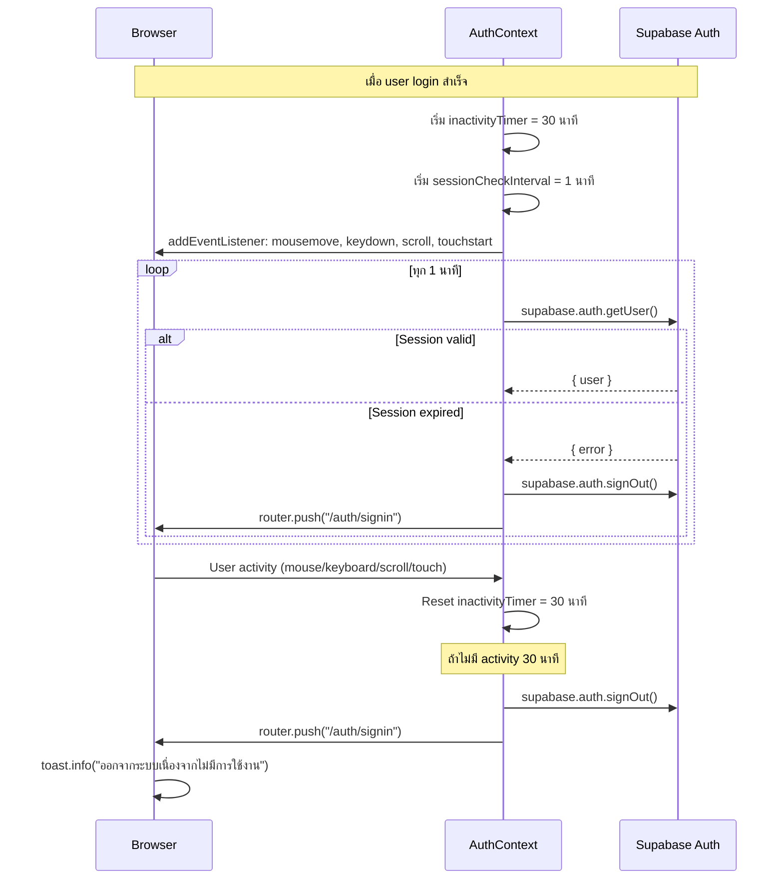

# Sequence Diagrams

เอกสาร Sequence Diagram แสดงลำดับการทำงานของ flow สำคัญในระบบ Evergreen ERP

---

## 1. Authentication Flow — Password Login

---

## 2. Authentication Flow — PIN Login

---

## 3. API Request — Permission Check Flow

---

## 4. BC Sync Flow

---

## 5. LINE Message Flow

---

## 6. RFID Print Flow

---

## 7. Sales Quotation Flow

---

## 8. Facebook Message Flow

---

## 9. Shipment Lifecycle Flow

---

## 10. Session Management & Inactivity Timeout

